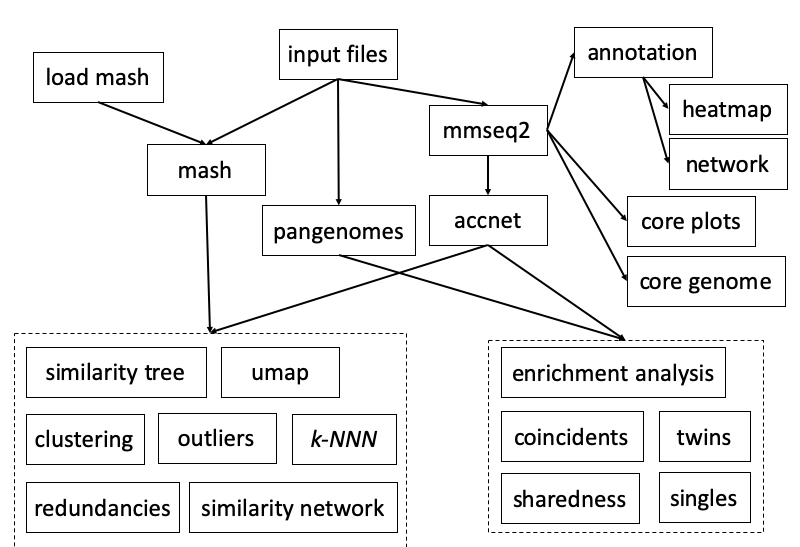
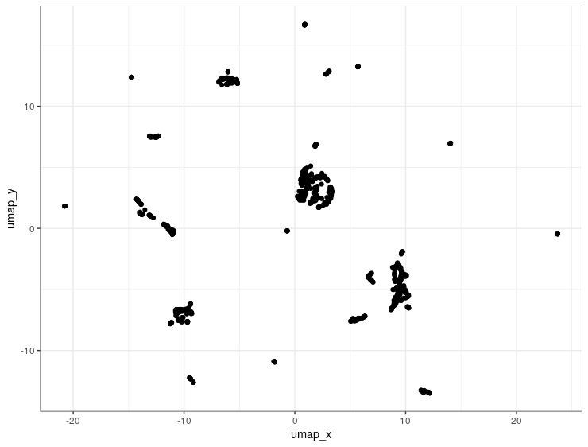

```{r, include = FALSE}
knitr::opts_chunk$set(
  collapse = TRUE,
  comment = "#>"
)
```

{width=100%}


# Installation

## Linux/Unix

PATO uses external binaries so it can not be included in CRAN repositorie. To install PATO use \emph{devtools} package

```{r eval=FALSE, include=TRUE}
install.packages("devtools")
```
 
Once you have installed \emph{devtools} intall PATO from GitHub.

```{r eval=FALSE, include=TRUE}
devtools::install_github("https://github.com/irycisBioinfo/PATO.git", build_vignettes = TRUE)
```


```{r setup, echo=FALSE}
knitr::opts_chunk$set(
	message = FALSE,
	warning = FALSE,
	include = FALSE
)
```

# Introduction
PATO is a R package designed to analyze pangenomes (set of genomes) intra or inter species. It allows to analyze the core-genome, accessory genome and whole genome, the population structure, and the horizontal gene transfer dynamics. PATO uses, as core software, [MASH](https://mash.readthedocs.io/en/latest/), [MMSeq2](https://github.com/soedinglab/MMseqs2) and R.

These software can handle thousands of genomes using conventional computers without the necessity to use on a HPC facilities. PATO can analyze data in mash distance format (whole genome) or accnet format (accessory genome) Most of the functions can handle both objets. Some functions are specific for some kind of data. The primitive objet *mmseq* is a orthologous clustering that is used to build accnet object, annotate the genomes and characterize the core-, accessory- and pan-genome size (and dynamic). {width=100%}


# Usage

## Classes
PATO has been designed as a toolkit. Most of the functions use as input other outputs functions, creating a complete workflow to analysis large genome datasets. As R package, PATO can interact with other packages as `ape`, `vegan`, `igraph` or `pheatmap`. We have tried to developed PATO compatible with `tidyverse` packages in order to use `%>%` pipe command and to be compatible with `ggplot2` and extensions (as `ggtree`).

In order to create a robust enviriment PATO uses specific data classes (S3 objects) to assure the compatibility among functions. PATO has 4 object classes:

  * `mash` object
  * `mmseq` object
  * `accnet` object
  * `nr_list` object

Other outputs take external objects as `igraph` or `ggplot`.

The idea to have these object is to share a structured data among functions. These objects can be inspected and some of their data can be used with external function/packages.

### `mash` class

A `mash` is a list of two element: `table`, `matrix`.

The first one, `my_mash$table`, is a square and simetric `matrix` with the distances among genomes. As a matrix has genomes as rownames and colnames 

The second one, `my_mash$matrix` is a `data.table/data.frame` with all the distancies as list. The table has the columns `c("Source","Target","Dist")`

### `mmseq` class
A `mmseq` object is a list of two elements: `table` and `annot`. 

First element, `my_mmseq$table`, includes a `data.table/data.frame` with four columns `c("Prot_genome", "Prot_Prot", "Genome_genome", "Genome_Prot")`. This is the output of MMSeqs2 and described the clustering of the input genes/proteins. First column referes to the genome that contain the representative gene/protein of the cluster. Second one, is the representative protein of the cluster (i.e. the cluster name). Third colum is the genome that includes the gene/protein of the fourth column.

In the second element, `my_mmseq$annot`, we can find a `data.frame/data.table` with the original annotation of all representative gene/protein of each cluster in two columns. The first one `Prot_prot` is the same that the second one of the first element.

### `accnet` class
An `accnet` object is a list of three elements: `list`, `matrix`, `annot`.

First element, `my_accnet$list`, includes a `data.frame/data.table` with the columns `c("Source","Target","degree")` the correspondences among proteins/genes and genomes and the degree of the corresponding protein/gene. In some cases, for example, when the `accnet` object cames from `accnet_with_padj` function or `pangenomes` the third column can be different and includes information such us the frequency of the protein/gene in the pangenome (in the case of `pangenomes`), or the p-value of the assotiation between the genome and the protein/gene (in the case of `accnet_with_padj`)

Second element, `my_accnet$matrix`, is a presence/absence matrix. It is very important to know that it has a column `Source`, so in the case of use the `matrix` out of PATO you shoul convert this column in rownames (` my_matrix <- my_accnet$matrix %>% column_to_rownames("Source")`)

### `nr_list` class

A `nr_list` is a S3 object of three elements: `Source`,`centrality` and `cluster`.
`nr_list` can be coherced to a `data.frame` of three columns using `as.data.frame` function. Element `Source` has the accesion/name of the genomes, `centrality` has the centrality value of the genome, according to the degrees of vertices, for its cluster. Finally, `cluster` has the memebership of the `Source` genome.


## Main Functions

PATO has two main data classes, `mash` and `mmseq`. MASH is a whole-genome comparisson tool that can compare 
thousands of genomes in a few minutes (even seconds).

On other hand, MMSeq2 is a ultra fast software for sensitive search and clustering genes or proteins. Since last versions of MMSeq2 it include *lin-clust* method that allow to cluster huge data sets in linear time (most of the method are quadratic time or log(n)²) but with high identities.

Both MASH and MMSeq2 allow multi-threading to accelerate the processing.

### MASH

Mash is a method for "Fast genome and metagenome distance estimation using MinHash"().  MASH accept nucleotide or aminoacid fasta files and estimated a similarity distance. To extend the information we recommend to read the main paper *Mash: fast genome and metagenome distance estimation using MinHash. Ondov BD, Treangen TJ, Melsted P, Mallonee AB, Bergman NH, Koren S, Phillippy AM. Genome Biol. 2016 Jun 20;17(1):132. doi: 10.1186/s13059-016-0997-x*

To create a `mash` object you need to supplie a list (a vector indeed) of files. By default `mash` use Amino Acids fasta files.

```{r eval=FALSE}
my_mash <- mash(my_list, type ="prot")
```

Besides, you can change some parameter as `n_cores`,	`sketch`, `kmer` and `type`.
```{r eval=FALSE, include=TRUE}
my_mash <- mash(my_list, n_cores = 20, sketch = 1000, kmer = 21, type = "prot")
```


### MMSeqs2
Creators of MMSeqs define their software as:
  
>MMseqs2 (Many-against-Many sequence searching) is a software suite to search and cluster huge protein and nucleotide sequence sets. MMseqs2 is open source GPL-licensed software implemented in C++ for Linux, MacOS, and (as beta version, via cygwin) Windows. The software is designed to run on multiple cores and servers and exhibits very good scalability. MMseqs2 can run 10000 times faster than BLAST. At 100 times its speed it achieves almost the same sensitivity. It can perform profile searches with the same sensitivity as PSI-BLAST at over 400 times its speed.

To create a `mmseq` object you just have to run:
```{r eval = FALSE, include=TRUE}
my_mmseq <- mmseqs(my_list)
```

You can change default parameter as `coverage`, `identity` or `evalue` among `n_cores`. Also you can set especifict parameters of clustering (searching for protein families and orthologous). These parameters are `cov_mode` and `cluster_mode`.
```{r eval=FALSE}
my_mmseq <- mmseqs(my_list, coverage = 0.8, identity = 0.8, evalue = 1e-6, n_cores = 20, cov_mode = 0, cluster_mode = 0)

```

The `mmseq` object is key in the analysis of the pangenome definition (core, accessory, pangenome) as well as other process such us annotation or population structure (if you are using accessory to defined it).

#### Coverage Mode
(this section has been extracted from https://github.com/soedinglab/MMseqs2/wiki)

MMseqs2 has three modes to control the sequence length overlap "coverage": (0) bidirectional, (1) target coverage, (2) query coverage and (3) target-in-query length coverage. In the context of cluster or linclust, the query is seen representative sequence and target is a member sequence. The `-cov-mode` flag also automatically sets the `cluster_mode`.
{width=100%}

#### Clustering modes
All clustering modes transform the alignment results into an undirected graph. In this graph notation, each vertex (i.e. node) represents a sequence, which is connected to other sequences by edges. An edge between a pair of sequences is introduced if the alignment criteria (e.g. `identity`, `coverage` and `evalur`) are fulfilled.

The Greedy Set cover (`cluster-mode = 0`) algorithm is an approximation for the NP-complete optimization problem called set cover. 

{width=70%}

Greedy set cover works by iteratively selecting the node with most connections and all its connected nodes to form a cluster and repeating until all nodes are in a cluster.
The greedy set cover is followed by a reassignment step. A Cluster member is assigned to another cluster centroid if their alignment score was higher. 

Connected component (`cluster_mode = 1`) uses transitive connection to cover more remote homologs.

{width=70%}

In connected component clustering starting at the mostly connected vertex, all vertices that are reachable in a breadth-first search are members of the cluster.

Greedy incremental (`cluster_mode = 2`) works analogous to CD-HIT clustering algorithm. 

{width=70%}

Greedy incremental clustering takes the longest sequence (indicated by the size of the node) and puts all connected sequences in that cluster, then repeatedly the longest sequence of the remaining set forms the next cluster.


### AccNET


Accnet is a representation of the "accessory genome" using a bipartite network. (see more in *Lanza, V. F., Baquero, F., de la Cruz, F. & Coque, T. M. AcCNET (Accessory Genome Constellation Network): comparative genomics software for accessory genome analysis using bipartite networks. Bioinformatics 33, 283–285 (2017)*). Accnet creates a graph using two kind of nodes: genomes and proteins/gene. One genome is connected to one proteins if the genome has this protein (i.e. a protein that belong to this protein familiy/cluster). The `accnet` object is other of the main data type in PATO. PATO can create some representations of the accessory genome (dendrograms, networks, plots....) and has some functions to analyse the accessory genome propertly. The function `accnet()` builds an `accnet` object taking into account the maximun frequency of each protein/gene to be cosidered as part of accessory genome. Moreover, the user can decide to include single protein/genes or not (those which are only present in one sample).

Accnet depends of the definition of protein families so the input of the `accnet()` function is a `mmseqs` object. The definition of the homologous cluster is critical to define the accessory genome.  
`accnet()` can be called as:
```{r eval=FALSE, include=TRUE}
my_accnet <- accnet(my_mmseq, threshold = 0.8, singles = TRUE)
```

or piping the `mmseqs()` function

```{r eval=FALSE, include= TRUE}
my_accnet <- mmseqs(my_files) %>% accnet(threshold = 0.8)
```


# Workflow

This is an example analysing 1.673 *Enterococcus faecium* downloaded from NCBI Assembly database. In this case we'll work with protein multi-fasta files (i.e. *.faa).

PATO can handle both nucleotide or aminoacid multi-fasta files. PATO does not use contigs fasta file. We recomend to use PROKKA output files `.faa` or `.ffn`. If you are using NCBI, EBI or other public database note that there are especific files for multi-fasta genes file or multi-fasta protein files. It is important to know that PATO take as annotation the headers of the fasta sequence, and usually, protein annotation is better than gen (CDS) annotation. Thus, we recomend to use protein fasta files.

It is very important to stablish the working directory. We recommend to set the workking directory in the folder where the multi-fasta files are. Make sure that you have enought free disk space.

```{r eval=FALSE, include=TRUE}
library(PATO)
# We strongly recommend to load tidyverse meta-package
library(tidyverse)
setwd("/myFolder/")
```
The main input file for PATO is a plain-text list of files with the path to the multi-fasta files. This list
could be easily made in your Unix console.

```{bash eval=FALSE, include = TRUE}
ls *.faa > my_list.txt
```

... and import to R enviroment.
```{r eval=FALSE, include=TRUE}
files <- read.table("my_list.txt",header = FALSE)
```

Now we create the main objects `mash`and `mmseqs`. We go to create a protein families with 80% of identity, 80% of coverage and a maximun of 1e-6 of Evalue.

```{r eval=FALSE, include=TRUE}
efaecium_mash_all <- mash(files, n_cores = 20, type = 'prot')
efaecium_mm<- mmseqs(files, coverage = 0.8, identity = 0.8, evalue = 1e-6, n_cores = 20)
```
In my case, I have 20 cores in my computer.
Finally we can create an `accnet` object:
```{r eval=FALSE, include=FALSE}
efaecium_accnet_all <- accnet(efaecium_mm,threshold = 0.8, singles = FALSE)
```


## Pre-processing

### Outliers
One of the things that happend when you download genomes from public databases is that some times you can find some *outliers*, genomes that not belong to the selected specie. PATO implement a function to indentify outliers and to remove it if is neccessary. In this case we set a threshold of 0.06 (~94% of ANI) to be considered as outlier.
```{r eval=FALSE, include=TRUE}
outl <- outliers(efaecium_mash_all,threshold = 0.06)
```
 


You can remove the outliers from `mash` or `accnet` objects

```{r eval=FALSE, include=TRUE}
efaecium_mash_all <-remove_outliers(efaecium_mash_all, outl)
efaecium_accnet_all <-remove_outliers(efaecium_accnet_all, outl)
```
(see )
If you desire to remove outliers from `files` object you can do it
```{r eval=FALSE, include=TRUE}
files <-  anti_join(files, outl, by=c("V1"="Source"))
```
This command remove the outliers from the original `files` object. We recommend do it before `mmseqs` command.

### Redundancies

Most of the times in the public databases are redundancies. The inclusion of outbreaks and studies about specific Sequence Types or Sub-clones  in the databases bias the real diversity of the species. PATO implement a function to select a non-redundant subset based on a fix distance (similarity), a % of samples or a selected number of genomes. It is an iterative approach so we implement a threshold of toerance due to some time find the exact solution is impossible. This function accepts `mash` or `accnet` object as input. Among, there is a function to create `mash` or `accnet` objects extracting the subset of genomes

```{r eval=FALSE, include=TRUE}
# For select 800 non redundant samples
nr_list <- non_redundant(efaecium_mash_all,number = 800)
```
or
```{r eval=FALSE, include=TRUE}
# For select a subset of samples with 99.99% of indentity
nr_list <- non_redundant(efaecium_mash_all, distance = 0.0001)
```
to create the objects only with the representatives of each cluster:
```{r eval=FALSE, include=TRUE}
efaecium_accnet <- extract_non_redundant(efaecium_accnet_all, nr_list)
efaecium_mash <- extract_non_redundant(efaecium_mash_all, nr_list)
```

Moreover, there is another function `non_redundant_hier()` that perform a hierarchical approach to perform the clusterization of the genomes. It is faster for big dataset (>1000 genomes) so we recommend use it in this cases.

```{r eval=FALSE, include=TRUE}
nr_list <- non_redundant_hier(efaecium_mash_all,800, partitions = 10)
efaecium_accnet <- extract_non_redundant(efaecium_accnet_all, nr_list)
efaecium_mash <- extract_non_redundant(efaecium_mash_all, nr_list)
```

The `partition` parameter set the number of hiaerarchical steps.

## Core Genome analysis

PATO implements a set of tools to inspect the core genome. It includes the pangenome composition (core, accessory, pangenome) and the function to create a core-genome alignment.

We can inspect the Pangenome composition of our dataset with:

```{r eval=FALSE, include=TRUE}
cp <- core_plots(efaecium_mm,reps = 10, threshold = 0.95, steps = 10)
```

{width=100%}


PATO can build a core-genome alignment to use with external software such as IQTree[http://www.iqtree.org/], RAxML-NG[http://www.exelixis-lab.org/software.html], FastTree[http://www.microbesonline.org/fasttree/] or other phylogenetic inference software. The core genome is computed based on a `mmseq` object, so the definition of core-genome depends of the parameters used in that step.

```{r eval=FALSE, include=TRUE}
core <- mmseqs(files) %>% core_genome()
export_core_to_fasta(core,"core.aln")

```

Some time, when you are using public data, core-genome can be smaller than you expect. Citating **Andrew Page**, creator of Roary (https://sanger-pathogens.github.io/Roary/)  

>**_I downloaded a load of random assemblies from GenBank. Why am I seeing crazy results?_**  
>_Gene prediction software rarely completely agrees, with differing opinions on the actual start of a gene, or which of the overlapping open reading frames is actually the correct one, etc. As a result, if you mix these together you can get crazy results. The solution is to reannotate all of the genomes with a single method (like PROKKA). Otherwise you will waste vast amounts of time looking at noise, errors, and the batch effect._

other times you can have a problem of *outliers*

The exported files are in Multi-alignment FASTA format and ca be use with most of the Phylogenetic tools. In this case we used IQTree for phylogenetic inference

```{bash eval=FALSE, include=TRUE}
iqtree -s core.aln 
```
And then we can read the output file to import to our R enviroment and plot the result.
```{r eval=FALSE, include=TRUE}
core_tree = read.tree("core.aln.treefile")
core_tree %>% midpoint.root() %>% ggtree()
```


You must take into account that Maximun Likelyhood tree can take long computational times.

## Accessory Genome Analysis


I this case we are creating the *accessory genome* taking those proteins presence in no more than 80% of the genomes.
```{r eval=FALSE, include=TRUE}
efaecium_accnet_all <- accnet(efaecium_mm,threshold = 0.8, singles = FALSE)
```


As we have shown above, PATO has an object type to accessory genome `accnet` and functions to analyze and visualize the content of the accessory genome and the relationship between genes/proteins and the genomes. We can visualize an `accnet` object as a bipartite network. Commonly, AccNET networks are very large, so, we recommend to visualize the networks using Gephi. We do not recommend to try visualize AccNET networks with more than 1.000 genomes.

One of the most interesting things when we analyze an accessory genome is try to find what genes/proteins are over-represented in a set of genomes. `accnet_enrichment_analysis()` function analyze what genes/proteins are over-represented in a *cluster* in comparisson with the population (i.e. in the wholem dataset). The clusters definition can be external (any catagorical metadata such as Sequence Type, Source, Serotype etc...) or internal using some clustering proccess. We have to take into account, that the redundancies can bias this kind of analysis. If there are an over-representation of samples, for example an outbreak, in your dataset the results could be bias. You will find more significant genes/proteins because the diversity of the dataset is not homegenously distributed. For this reason we recommend to use a non redundant set of samples. In this example we select 800 non redundant genomes.

```{r eval=FALSE, include=TRUE}
ef_nr<- non_redundant(efaecium_mash,number = 800 )
efaecium_accnet_nr <- extract_non_redundant(efaecium_accnet, ef_nr)
ef_800_cl <- clustering(efaecium_accnet_nr, method = "mclust", d_reduction = TRUE)
```

Now we can visualize the network using Gephi.

```{r eval=FALSE, include=TRUE}
export_to_gephi(efaecium_accnet_nr, "accnet800", cluster = ef_800_cl)
```
{width=100%}

To perform the enrichment analysis we use:
```{r eval=FALSE, include=TRUE}
accnet_enr_result <- accnet_enrichment_analysis(efaecium_accnet_nr, cluster = ef_800_cl)

accnet_enr_result

# A tibble: 854,887 x 14
   Target Source Cluster perClusterFreq ClusterFreq ClusterGenomeSi… perTotalFreq TotalFreq OdsRatio  pvalue
   <chr>  <chr>    <dbl>          <dbl>       <int>            <int>        <dbl>     <int>    <dbl>   <dbl>
 1 WP_00… GCF_0…       1          0.248          53              214        0.145       172     1.71 2.44e-6
 2 WP_00… GCF_0…       1          0.248          53              214        0.145       172     1.71 2.44e-6
 3 WP_00… GCF_0…       1          0.248          53              214        0.145       172     1.71 2.44e-6
 4 WP_00… GCF_0…       1          0.248          53              214        0.145       172     1.71 2.44e-6
 5 WP_00… GCF_0…       1          0.248          53              214        0.145       172     1.71 2.44e-6
 6 WP_00… GCF_0…       1          0.248          53              214        0.145       172     1.71 2.44e-6
 7 WP_00… GCF_0…       1          0.248          53              214        0.145       172     1.71 2.44e-6
 8 WP_00… GCF_0…       1          0.248          53              214        0.145       172     1.71 2.44e-6
 9 WP_00… GCF_0…       1          0.248          53              214        0.145       172     1.71 2.44e-6
10 WP_00… GCF_0…       1          0.248          53              214        0.145       172     1.71 2.44e-6
# … with 854,877 more rows, and 4 more variables: padj <dbl>, AccnetGenomeSize <int>, AccnetProteinSize <int>,
#   Annot <chr>
```

Now, we can export a new network with the *adjusted p-values* as edge-weigth.

```{r eval=FALSE, include=TRUE}
accnet_with_padj(accnet_enr_result) %>% export_to_gephi("accnet800.padj", cluster = ef_800_cl)
```

{width=100%}

PATO also include some functions to study the genes/proteins distribution: `singles()`, `twins()` and `conicidents()`.  

* `singles()` finds those genes/proteins that are only present in a sample (genome, pangenome...).
* `twins()` finds those genes/proteins that have the same connections (i.e. genes/proteins present in the same genomes).
* `coincidents()` finds those genes/proteins with similar connections (i.e. genes/proteins that usually are together)

The differencies between `twins()` and `concidents` are that `coincidents()` is more flexible and therefore less sensitive to outliers. `twins()` is faster and accurate but is very sensitive to noise or outliers because just one missing conection (for example a bad prediction of a protein in a genome) remove automatically that proteins from the `twin` group. On other hand, `coincidents()` is slower, and some time the results are to much generalistic giving big cluster of pseudo-core.

## Population structure

PATO includes tools for population structure search and comparisson. PATO can analyse the population structure of the whole-genome (MASH based) or the accessory structure (AccNET based)


We can visualize our dataset as a dendrogram (i.e a tree). PATO allows to visualize both `mash` and `accnet` data as a tree. In the caso of `accnet` data, first PATO calculate a distance matrix using the presence/absence matrix in combination with Jaccard distance. The function `similarity_tree()` implement different methods to build the dendrogram. Phylogenetic aproaches such as Neighbour Joining, FastME:Minimun Evolution and  hierarchical clustering method such us complete linkage, UPGMA, Ward's mininum variance, and WPGMC.
```{r eval=FALSE, include=TRUE}
mash_tree_fastme <- similarity_tree(efaecium_mash)
mash_tree_NJ <- similarity_tree(efaecium_mash, method = "NJ")
mash_tree_upgma <- similarity_tree(efaecium_mash,method = "UPGMA")
accnet_tree_upgma <- similarity_tree(efaecium_accnet,method = "UPGMA")
```
The output has a `phylo` format, so can be visualize with external packages as `ggtree`.
```{r eval=FALSE, include=TRUE}
ggtree(mash_tree_NJ) + geom_tippoint()
```


Using others external packages, we can compare the arragement of the pangenom (`mash` data) against the accessory genome (`accnet`)
```{r eval=FALSE, include=TRUE}
library(dendextend)
tanglegram(ladderize(mash_tree_upgma), ladderize(accnet_tree_upgma), fast = TRUE)

```

{width=100%}

Some Maximun Likelyhood inference trees software accept,as input, binary data (0-1) alignments.So, we can use accessory data (*accnet*) to infere a tree (non-phylogenetic) with this data. This is similar to the `similarity_tree()` but instead to be based on distance metrics it's based on ML principles. To export this alignment you can use `export_accnet_aln()`.

```{r eval=FALSE, include=FALSE}
mmseqs(files) %>% accnet() %>% export_accnet_aln(.,file ="my_accnet_aln.fasta") 
```

And then you can use it as input alignment

```{bash eval=FALSE, include=FALSE}

iqtree -s my_accnet_aln.fasta -st BIN

```
Again, we can import to R and plot it.
```{r eval=FALSE, include=TRUE}
acc_tree = read.tree("acc.aln.treefile")
acc_tree %>% midpoint.root() %>% ggtree()
```


This kind of alignments can be very large. Most of the times accessory genomes contains a lot of spurious genes/proteins that do not add information to the alignment. For this reason `export_accnet_aln()` has a parameter, `min_freq`, to filter the genes/proteins by their frequency. This option cut significantly the alingment length and improves computational times.

PATO has a set of function to visualize data. We have saw the tree but algo implements methods to visualize as networks the relationships among genomes. **K-Nearest Neighbour Networks** is a representation of the realtionship of the data in a network plot. This function (`knnn()`) builds a network linking each genome with their *K* best neighbours instead of chose a distance threshold. This approach minimize the clutering of the network and tries to create a connected network. The method can chose the *K* best neighbours with or without repetitions. That means that if **`repeats=FALSE`** each node are linked with the best *K* neighbours that **does be not linked yet** with the node.
```{r eval=FALSE, include=TRUE}

# K-NNN with 10 neighbours and with repetitions
knnn_mash_10_w_r <- knnn(efaecium_mash,n=10, repeats = TRUE)
# K-NNN with 25 neighbours and with repetitions
knnn_mash_25_w_r <- knnn(efaecium_mash,n=25, repeats = TRUE)
# K-NNN with 50 neighbours and with repetitions
knnn_mash_50_w_r <- knnn(efaecium_mash,n=50, repeats = TRUE)

```

`knnn()` function returns an `igraph` object that can be visualize with several packages. However, PATO implements its own function `plot_knnn_network()` that uses `threejs` and the own `igraph` for layouting and plotting the network. Due to the common size of the network we strongly recommend to use this function or use the external software Gephi (https://gephi.org/). You can use the function `export_to_gephi()` to export these networks to Gephi.

```{r eval=FALSE, include=TRUE}
export_to_gephi(knnn_mash_50_w_r,file = "knnn_50_w_r.tsv")
```
{width=100%}

If you want, you can use the internal function `plot_knnn_network()` to visualize the network. This funtion uses `igraph` layouts algorith to arrange the network and `threejs` package to draw and explore the network.

```{r eval=FALSE, include=TRUE}
plot_knnn_network(knnn_mash_50_w_r)
```

{width=100%}


PATO includes a different clustering methods for different kind of data (objects). `clustering()` function joins all the different approaches to make easier the process. For `mash` and `accnet`objects  we have the following methods:

+ **mclust**: It perform clustering using Gaussian Finite Mixture Models. It could be combine with d_reduction. This method uses Mclust package. It has been implemented to find the optimal cluster number
+ **upgma**: It perform a Hierarchical Clustering using UPGMA algorithm. The user must provide the number of cluster.
+ **ward.D2**: It perform a Hierarchical Clustering using Ward algorithm. The user must provide the number of cluster.
+ **hdbscan**: It perform a Density-based spatial clustering of applications with noise using DBSCAN package. It find the optimal number of cluster.

Any of the above methods is compatible with a multidimentsional scaling (MDS). PATO performs the MDS using **UMAP** algorithm (Uniform Manifold Approximation and Projection). UMAP is a tools for MDS, similar to other machine learning MDS technics as t-SNE or Isomap.  Dimension reduction algorithms tend to fall into two categories those that seek to preserve the distance structure within the data and those that favor the preservation of local distances over global distance.  Algorithms such
as PCA , MDS , and Sammon mapping fall into the former category while t-SNE, Isomap or UMAP,fall into the later category. This kind of MDS combine better with the clustering algorithms due to clustering process try to find local structures.

```{r eval=FALSE, include=TRUE}
ef_cl_mclust_umap <- clustering(efaecium_mash, method = "mclust",d_reduction = TRUE)
```
On other hand, `clustering()` can handle `knnn` networks as input. In this caso, PATO uses network clustering algorithms such us:

+ greedy: Community structure via greedy optimization of modularity
+ louvain: This method implements the multi-level modularity optimization algorithm for finding community structure
+ walktrap: Community strucure via short random walks

```{r eval =FALSE, include=TRUE}
ef_cl_knnn <-clustering(knnn_mash_50_w_r, method = "louvain")
```

Whatever the method used, the output has allways the same structure: a `data.frame` with two columns `c("Source","Cluster")`. The reason of this format is to be compatible with the rest of the data, being able to combine with the rest of the objects using `Source` variable as key.

To visualize the clustering data or just to see the data structure we can use `umap_plot()` function. The functions performs a `umap` reduction and plot the results. We can include the `clustering` results as a parameter and visualize it.


```{r eval =FALSE, include=TRUE}
umap_mash <- umap_plot(efaecium_mash)
```
{width=80%}

```{r eval =FALSE, include=TRUE}
umap_mash <- umap_plot(efaecium_mash, cluster = ef_cl_mclust_umap)
```
{width=80%}

We also can use `plot_knnn_network()` to visualize the network clustering results.

```{r eval=FALSE, include=TRUE}
cl_louvain = clustering(knnn_mash_25_wo_r, method = "louvain")
plot_knnn_network(knnn_mash_25_wo_r, cluster = cl_louvain, edge.alpha = 0.1)
```
{width=100%}

## Annotation

PATO has a function to annotate the Antibiotic Resistance Genes and the Virulence Factor: `annotate()`. Antibiotic resistance are predicted using MMSeqs2 over ResFinder database (https://cge.cbs.dtu.dk/services/ResFinder/) (doi: 10.1093/jac/dks261). For Virulence Factors we use VFDB (http://www.mgc.ac.cn/cgi-bin/VFs/v5/main.cgi)(doi: 10.1093/nar/gky1080). VFBD has two sets of genes `VF_A` the *core-dataset* and `VF_B` the *full dataset*. *Core dataset* includes genes associated with experimentally verified VFs only, whereas *full dataset* covers all genes related to known and predicted VFs in the database.

`annotate()` results is a table with all positive hits of each gene/protein of the dataset (files). `annotate()` can re-use the results of `mmseqs()` to accelerate the proccess. In the same way, the query can be *all* genes/proteins or *accessory* genes/proteins. The results are quite raw so user must curate the table. We recommend to use the `tidyverse` tools. It is very easy to obtain a greatfull results.

```{r eval=FALSE, include=TRUE}
library(tidyverse)

annotation <- annotate(efaecium_mm, type = "prot",database = c("AbR","VF_A"))

annotation %>% 
  filter(pident > 0.95 ) %>% #remove all hits with identity lower than 95%
  filter(evalue < 1e-6) %>%  #remove all hits with E-Value greater than 1e-6
  group_by(Genome,Protein) %>% top_n(1,target) #select only the best hit for each protein-genome.
  
```

PATO includes also a function to create a heapmap with the annotation:
```{r eval=FALSE, include=TRUE}
heatmap_of_annotation(annotation %>% filter(DataBase =="AbR"), #We select only "AbR" results
                      min_identity = 0.99)
```

[Annotation HeatMap](https://github.com/irycisBioinfo/PATO/blob/master/vignettes/annotation_heatmap.pdf)

Or to visualizae as a network.

```{r eval=FALSE, include=TRUE}
network_of_annotation(annotation %>% filter(DataBase =="AbR"), min_identity = 0.99) %>% export_to_gephi("annotation_Network")
```

{width=100%}


## Pangenomes Analysis

PATO is designed even to analyze the relationship among pangenomes of different (or not) species. Thats mean to analyze cluster of genomes (pangenomes) among then as individual elements. In this example we analyze 49.591 firmicutes genomes from NCBI data base. For that kind of large datasets it is recomended to use the specific pipeline for pangenomes. This pipeline first cluster the genomes into pangenomes, for example, cluster of species or intra-specie phylogroups or even sequence types (ST). The diversity of each cluster depends on the parameter *distance*. The pipeline creates homogeneous (in phylogenetic distance) clusters. Then the pipeline produces a `accnet` object so all the above described function can be use with this object as a common `accnet` object. The pipeline also include parameters to set the minimun amount of genomes to consider a pangenome and the minimun frequence of a protein/gene family to be included in a pangenome.

```{r eval=FALSE, include=TRUE}
res <- pangenomes_from_files(files,distance = 0.03,min_pange_size = 10,min_prot_freq = 2)

export_to_gephi(res,"/storage/tryPATO/firmicutes/pangenomes_gephi")
```

In this case we produce a gephi table to visulize the accnet network of the dataset. To annotate the network we use the NCBI assembly table and takes the species name of each pangenome cluster.

```{r eval=FALSE, include=TRUE}
assembly = data.table::fread("ftp://ftp.ncbi.nlm.nih.gov/genomes/refseq/bacteria/assembly_summary.txt",sep = "\t",skip = 1, quote = "")

colnames(assembly) = gsub("# ","",colnames(assembly))

annot = res$members %>%  
  mutate(file = basename(path)) %>% 
  separate(file,c("GCF","acc","acc2"),sep = "_", remove = FALSE) %>% 
  unite(assembly_accession,GCF,acc,sep = "_") %>% 
  left_join(assembly) %>%
  separate(organism_name,c("genus","specie"), sep = " ") %>% 
  group_by(pangenome,genus,specie) %>% 
  summarise(N = n()) %>% 
  distinct() %>% 
  group_by(pangenome) %>% 
  top_n(1,N) %>% 
  mutate(ID = paste("pangenome_",pangenome,"_rep_seq.fasta", sep = "",collapse = "")) %>% 
  write_delim("/storage/tryPATO/firmicutes/pangenomes_gephi_extra_annot.tsv",delim = "\t", col_names = TRUE)
```
We chose as species name the specie most frequent in each cluster. Then usin Gephi we visualiza the network.

{width=100%}

Other way to visualize the results is a heatmap of the sharedness among the pangenoms. PATO includes the function sharedness to visualize this result. To visualize the `data.table` result from `sharedness()` function we can use the package `pheatmap`. As the input value of `pheatmap` can be only a matrix we must first transform our result into a matrix:

```{r eval=FALSE, include=TRUE}
sh <-  sharedness(res)
sh  <-  sh %>% as.data.frame() %>% 
  rownames_to_column("ID") %>% 
  inner_join(annot) %>% 
  unite(Name,genus,specie,pangenome, sep = "_") %>% 
  select(-ID,-N)%>% 
  column_to_rownames("Name")

colnames(sh) = rownames(sh)


```

Now we can execute `pheatmap()` with our pangenome dataset.

```{r eval=FALSE, include=TRUE}
pheatmap::pheatmap(sh,clustering_method = "ward.D2", clustering_distance_cols = "correlation", clustering_distance_rows = "correlation")
```

{width=100%}
